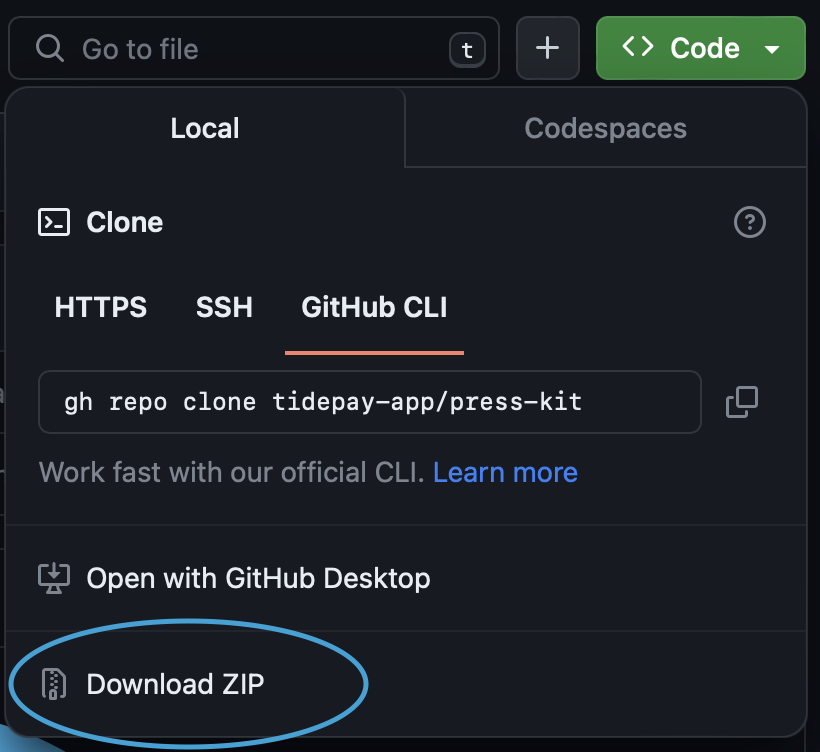

  

# tidepay Press Kit

## Logo Guide

Included in this kit are brand guidelines on how to use the logo, such as a color pallette, typography, spacing, etc. There are even examples of how the logo could be cleanly used.

## How to Access Assets

You may choose to navigate to specific assets and download them individually. There is also the option to download this entire press kit source as a ZIP file by clicking on the "〈〉Code ⌄" button and then selecting the "Download ZIP" option (see image).

## License

Thank you for using our Press Kit Images and Assets. By accessing and using the Press Kit, you agree to the following terms and conditions:

1. Ownership: The Press Kit Images and Assets are owned by "tidepay". You do not have any ownership rights to the Images and Assets, and we reserve the right to revoke your access to them at any time for any reason.

1. Permitted Use: You may use the Press Kit Images and Assets for editorial and promotional purposes related to tidepay or its products and services, including in print, online, and social media. You may not use the Press Kit Images and Assets for any other purpose without prior written consent from tidepay.

1. Modification: You may not modify the Press Kit Images and Assets in any way, including resizing, cropping, or altering their colors. You may resize the Images and Assets to fit your publication or promotional material, but you must maintain their original aspect ratio.

1. Attribution: You must credit tidepay for any use of the Press Kit Images and Assets, including in your publication or promotional material. The credit line should read: "Courtesy of tidepay."

1. No Transfer: You may not sell, transfer, sublicense, or otherwise distribute the Press Kit Images and Assets to any third party.

1. Indemnification: You agree to indemnify and hold harmless tidepay and its affiliates, officers, directors, and employees from any claims, damages, or losses arising out of your use of the Press Kit Images and Assets.

1. Termination: This license agreement will automatically terminate if you violate any of its terms and conditions. Upon termination, you must immediately cease all use of the Press Kit Images and Assets.

By downloading and using the Press Kit Images and Assets, you acknowledge that you have read and agree to this license agreement. If you do not agree to the terms and conditions of this agreement, do not use the Press Kit Images and Assets.
